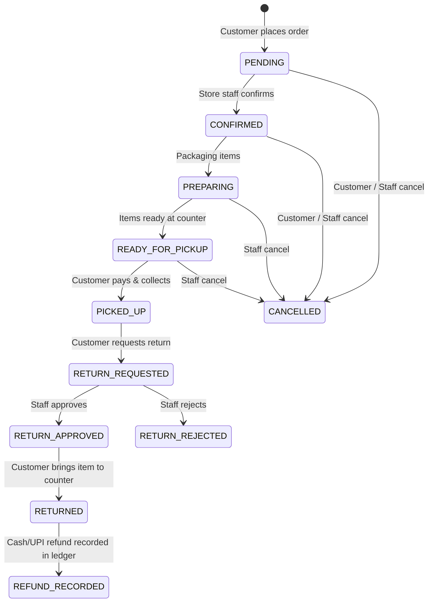

# JAINAM TRADERS - SYSTEM ARCHITECTURE DOCUMENTATION

## 1. Executive Summary
**Jainam Traders** is a production-grade local retail and gift commerce platform built with a physical pickup model:
**Discover & Reserve Online → Inspect in Person at Counter → Pay at Shop (Cash or UPI)**.

There are no online payment gateways (Razorpay, Stripe, etc.) and no delivery couriers. The application is built to bridge local retail with modern digital discovery and reservation guarantees.

---

## 2. Technology Stack
- **Framework**: Next.js 15 (App Router, Server Components & Route Handlers)
- **Language**: TypeScript (Strict Mode)
- **Styling**: Tailwind CSS with bespoke warm Indian retail theme (Terracotta Copper `#B84A1C`, Saffron Amber `#D97706`, Soft Pearl `#FAF8F5`, Slate Dark `#1C1917`)
- **Database & Storage**: PostgreSQL via Supabase with Row Level Security (RLS)
- **Mobile Packaging**: Progressive Web App (PWA) + Capacitor for Android & iOS
- **Testing**: Vitest (Unit tests, integration tests, concurrency tests, security validation)

---

## 3. Order State Machine Architecture
The application defines a deterministic, non-arbitrary state machine enforced strictly server-side:

### Transition Invariants
1. Customers may only self-cancel while the order is in `PENDING` or `CONFIRMED`.
2. Transition to `PICKED_UP` can only be performed by authorized store staff after physical verification and cash/UPI collection.
3. Transition to `CANCELLED` automatically releases all reserved stock back to the shelf.
4. Transition to `PICKED_UP` permanently deducts inventory from `stockQuantity`.
5. Transition to `REFUND_RECORDED` requires a physical refund ledger entry with receipt number and staff signature.

---

## 4. Concurrency & Inventory Reservation Engine
To eliminate overselling the last remaining unit:
- Checkout requests acquire an atomic reservation lock.
- In PostgreSQL, this is backed by `SELECT ... FOR UPDATE` row locks in the RPC function `reserve_order_inventory()`.
- Customer stock visibility is strictly decoupled from exact counts:
  - Customers see: `Available for pickup`, `Currently unavailable`, or `Available soon`.
  - Raw stock numbers are never leaked to client views.

---

## 5. Physical Payment & Return/Refund Flow
Because payment happens at the shop register:
1. Orders are created with `payment_status = 'UNPAID'`.
2. Upon customer arrival, staff scans the customer's QR code or enters the order number (`JT-YYYY-XXXXXX`).
3. Customer inspects items.
4. Payment is accepted via Cash or UPI at the counter register.
5. Order status is updated to `PICKED_UP` and `payment_status = 'PAID'`.
6. Printable thermal/A4 receipt is generated.
7. If an item is returned, staff records a manual refund record specifying refund method (Cash or UPI) and receipt reference.

---

## 6. AI Assistant Architecture
The in-app AI assistant acts as a live concierge using tool calling:
- `get_shop_information`: Retrives current store hours, address, and pickup instructions.
- `search_products`: Queries active catalog with live pricing.
- `get_product_availability`: Checks whether an item is available for pickup without hallucinating.
- `get_order_status`: Looks up real order status.
- `get_return_policy`: Retrieves verified 7-day counter policy.
- Automated escalation triggers WhatsApp and store phone shortcuts when complaints or human assistance are requested.
